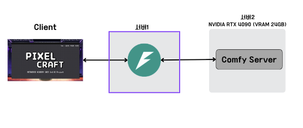
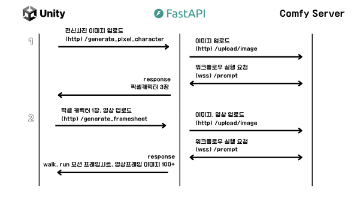
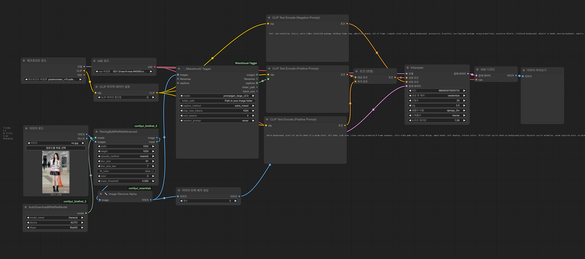
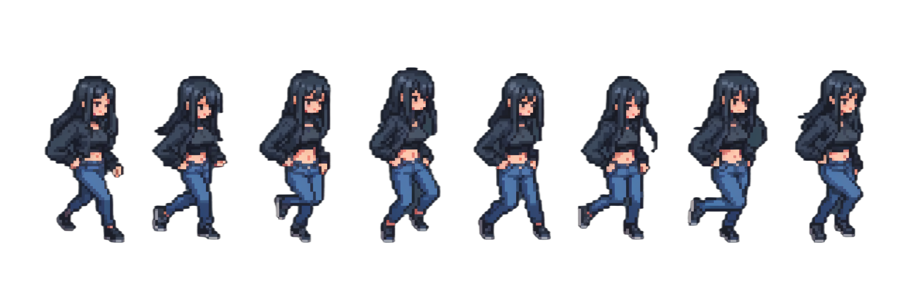
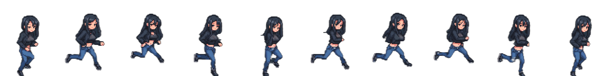

# 🧩 PixelCraft

> 전신사진과 짧은 포즈 영상을 입력하면 **움직이는 픽셀 캐릭터**를 자동으로 생성해주는 오픈소스 프로젝트입니다.  
> Unity 환경에서 직접 애니메이션을 검증할 수 있으며, 인디 게임 개발자와 SNS 사용자 모두 활용할 수 있습니다.

## 프로젝트 소개
PixelCraft는 사용자의 사진과 영상을 기반으로 **걷기·뛰기 프레임시트**와 **영상 기반 포즈 프레임**을 자동 생성합니다.

- 전신사진 + 8초 이내 영상 입력
- 3개의 픽셀 캐릭터 이미지 후보 생성
- 선택한 캐릭터로 걷기/뛰기 프레임시트 및 영상 프레임 자동 생성
- Unity에서 즉시 애니메이션 검증 가능
  
## 주요 기능
- 원클릭 픽셀 캐릭터 생성 (사진+영상 업로드)
- Unity에서 방향키+Shift를 활용한 걷기/뛰기 모션 검증
- `E` 키 입력 시 약 100장의 프레임을 이어붙여 영상처럼 재생
- 결과물 저장 기능 (프레임시트/이미지 로컬 저장)


## 개발환경
- Frontend: Unity 6000.0.28f1
- Relay Backend: Python 3.12, FastAPI
- Generation Backend: ComfyUI + Stable Diffusion, PyTorch 2.6.0 + CUDA 12.6
    - GPU: RTX 4090 24GB (개발/측정 기준)

## 시스템 아키텍처



---
## ▶️ 실행 방법

### Unity 실행
1. [GitHub Release](https://github.com/binmuxiz/PixelCraft/releases) 페이지에서 `PixelCraft_Windows.zip` 파일을 다운로드합니다.  
2. 압축 해제 후 실행 파일(`PixelCraft.exe`)을 실행합니다.  
3. 전신사진/영상을 업로드하여 캐릭터를 생성하고 Unity 환경에서 결과를 확인할 수 있습니다.

### API 서버 실행
```bash
cd api-server
pip install -r requirements.txt
uvicorn app.main:app
```

---
## ComfyUI 워크플로우


---

### 🖼️ 이미지 생성 결과
- Walk 프레임시트 (1장)
- Run 프레임시트 (1장)
- 영상 기반 프레임 이미지 (100장 이내)





---
## 📜 라이선스
이 프로젝트는 [MIT 라이선스](./LICENSE) 하에 배포됩니다.
